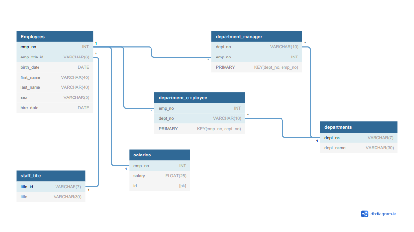

# sql-challenge
The assignment involved the creation of a Database starting from [6 CSV files](./employeeSQL/data).
# Data Modeling
The data were first modeled by creating an ERD of the tables. A free online tool ([dbdiagram](https://dbdiagram.io/home)) was used to create the ERD. The tool is also directly converting the code you write for the creation of the ERD into SQL code. The ERD code can be found [here](./employeeSQL/ERD_raw.sql) while the code converted in SQL syntax is [here](./employeeSQL/ERD.sql). \

# Data Engineering and Analysis
The data were engineered and analyzed by using PostrgreSQL 11 with PgAdmin 4. The queries written to create the tables and then filter them can be found [here](./employeeSQL/queries.sql). Some table view were created mainly for exercise. The table view named 'Employees_info' was used for the data visualization part developed in python.
# Data Visualization
A connection between postgresSQL and Python was established using the module [sqlalchemy](https://docs.sqlalchemy.org/en/14/core/engines.html). 
