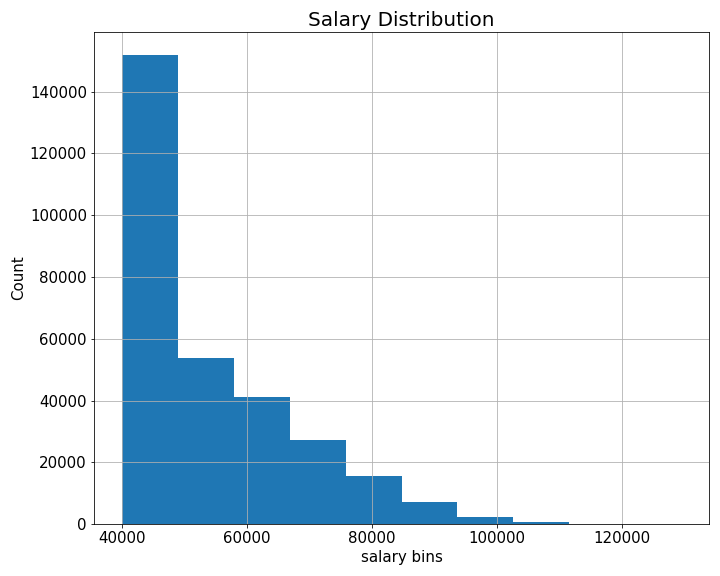
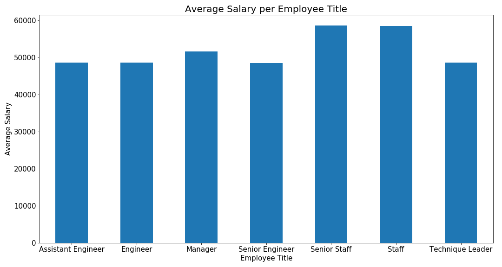

# sql-challenge
The assignment involved the creation of a Database starting from [6 CSV files](./data).
# Data Modeling
The data were first modeled by creating an ERD of the tables. A free online tool ([dbdiagram](https://dbdiagram.io/home)) was used to create the ERD. The tool is also directly converting the code you write for the creation of the ERD into SQL code. The ERD code can be found [here](./employeeSQL/ERD_raw.sql) while the code converted in SQL syntax is [here](./employeeSQL/ERD.sql). \

# Data Engineering and Analysis
The data were engineered and analyzed by using PostrgreSQL 11 with PgAdmin 4. The queries written to create the tables and then filter them can be found [here](./employeeSQL/queries.sql). Some table views were created mainly for exercise. The table view named 'Employees_info' was used for the data visualization part developed in python.
# Data Visualization
A connection between postgresSQL and Python was established using the module [sqlalchemy](https://docs.sqlalchemy.org/en/14/core/engines.html). \
An histogram to visualize the most common salary ranges for employees was created: \
 \
A bar chart to visualize the average salary by title was made: \
 \
Note: in the code to save the bar plot the filepath used is :
```python
plt.savefig('output\\average_salary.png')
```
I believe this syntax works only on windows machines, if you are running the code on an apple device you will probably need to remove one of the two backslash.

The end of the assignment made me laugh:
```python
# Check of the ID number reported in the epilogue out of curiosity.
ID = 499942
df[df.isin([ID]).any(axis=1)]
```
|         | emp_no | last_name | first_name | sex | title            | salary |
| :-----: | :-:    | :-:       | :-:        | :-: |   :-:            | :-:    |
| 37455   | 499942 | Foolsday  | April      | F   | Technique Leader | 40000.0|

